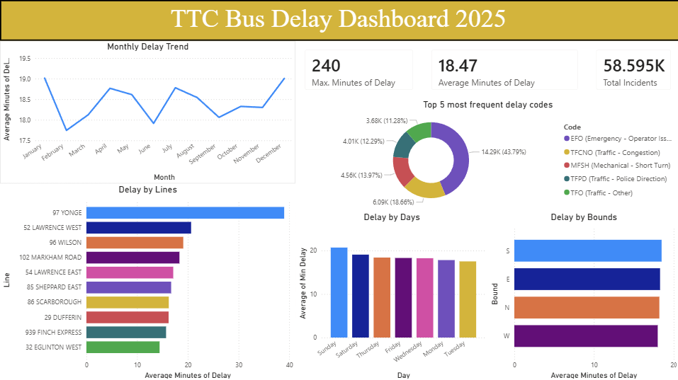

# TTC Bus Delay Dashboard 2025 

An interactive Power BI dashboard analyzing Toronto Transit Commission (TTC) bus delay incidents throughout 2025.

## Dashboard Preview

## Overview
This project explores **58,595 TTC bus delay incidents** recorded in 2025, uncovering patterns in when, where, and why delays occur across Toronto's bus network.

## Key Findings
- **97 Yonge** is the most delayed route with an average delay of ~38 minutes
- **Sundays** have the highest average delays, while **Tuesdays** are the most reliable
- **Emergency Operator Issues (EFO)** account for nearly 44% of all delay incidents
- **Southbound** buses experience the longest average delays by direction
- Average delay across all incidents is **18.47 minutes**

## Dashboard Visuals
| Visual | Description |
|--------|-------------|
| KPI Cards | Max delay, average delay, and total incident count |
| Monthly Delay Trend | Line chart showing how average delays fluctuate month to month |
| Delays by Day | Which days of the week have the worst delays |
| Top 5 Delay Codes | Donut chart breaking down the most frequent causes of delays |
| Delay by Route | Top 10 most delayed bus routes by average delay |
| Delay by Direction | Average delay broken down by N/S/E/W bound travel |

## Delay Code Legend (Top 5)
| Code | Meaning |
|------|---------|
| EFO | Emergency - Operator Issue |
| TFCNO | Traffic - Congestion |
| MFSH | Mechanical - Short Turn |
| TFPD | Traffic - Police Direction |
| TFO | Traffic - Other |

## Data Source
- [City of Toronto Open Data Portal](https://open.toronto.ca/) - TTC Bus Delay Data 2025
- Dataset contains: Date, Route, Time, Day, Station, Delay Code, Minutes of Delay, Direction

## Tools Used

- **Power BI Desktop** - data cleaning, modeling, and visualization
- **Power Query** - filtering outliers, adding calculated columns (Month, Hour, cleaned Bound values)

## How to Use
1. Download the `.pbix` file
2. Open in Power BI Desktop (free download from Microsoft)
3. All data is embedded - no additional setup needed
